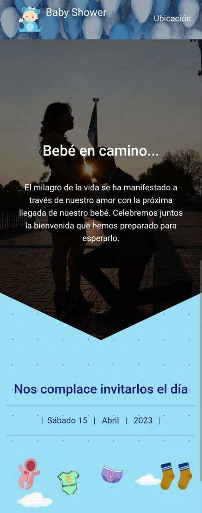

# 🍼 Baby Shower - Invitación Web

Proyecto desarrollado como práctica de desarrollo web para crear una página de invitación digital para un **Baby Shower**.

## 📌 Descripción
Este repositorio contiene una página web diseñada como invitación digital para celebrar la llegada de un nuevo integrante a la familia.  
El objetivo fue aplicar conocimientos de HTML y diseño web para crear una experiencia visual dulce, cálida y funcional.

## 🎯 Objetivos del proyecto
- Practicar estructura básica en HTML
- Diseñar una página web temática para Baby Shower
- Aplicar estilos visuales suaves
- Crear una invitación digital accesible desde cualquier dispositivo

## 🛠️ Tecnologías utilizadas
- HTML5
- CSS3
- Diseño responsivo
- GitHub Pages para despliegue

## 🌐 Demo en vivo
Puedes ver la invitación web funcionando aquí:  
👉 [https://jrc501.github.io/BabyShower/](https://jrc501.github.io/BabyShower/)

## 🚀 Vista previa

  
   
  <em>Invitación digital para celebrar la llegada del bebé</em>

## 🚧 Próximas mejoras
- [ ] Agregar animaciones suaves (globos flotando)
- [ ] Implementar modo oscuro/claro
- [ ] Añadir playlist de fondo (música suave)
- [ ] Integrar conteo regresivo con JavaScript

## 👨‍💻 Autor
**Juan Reyes**  
💻 Ing. en Computación en formación  
🎨 Interés en desarrollo web y tecnología  
📍 CDMX

---

🍼 *Hecho con 💙 para celebrar una nueva vida* 🎈
